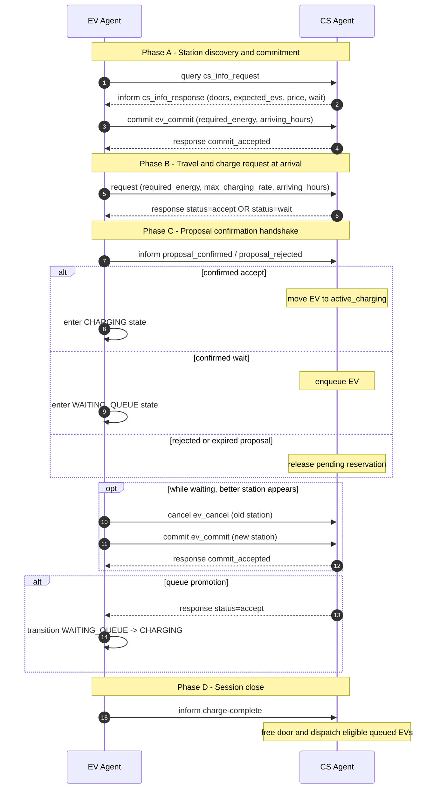

# EV <-> Charging Station Interaction

This document describes the practical message flow between the EV agent and the Charging Station (CS) agent.

## Scope

- Protocol: `ev-charging`
- EV starts by requesting charge.
- CS replies with a proposal (`accept` or `wait`).
- EV confirms proposal.
- CS commits the decision.

## End-to-End Steps

1. EV sends charge request to CS.
2. CS parses request and evaluates capacity.
3. CS stores a pending proposal and replies with:
   - `status: accept` when a slot can be reserved now.
   - `status: wait` when no slot is currently available.
4. EV receives proposal and sends confirmation (`accepted: true/false`).
5. CS receives confirmation and applies outcome:
   - confirmed `accept` -> EV enters active charging.
   - confirmed `wait` -> EV enters queue.
   - rejected/expired proposal -> CS releases temporary reservation.
6. When charging reaches target, EV sends `charge-complete`.
7. CS frees one door and tries to dispatch queued EVs.

## Sequence Diagram (Current Code-Accurate Flow)

### Notes about fidelity

- The CS decision is not final at proposal time; it becomes effective only after EV confirmation.
- Pending `accept` proposals temporarily reserve slots and expire by TTL if not confirmed.
- Queue wait estimates are based on active sessions, queue, and pending slot reservations.

## EV Side Responsibilities

1. Choose target charging station.
2. Send request with required energy, max charging rate, and optional arrival time.
3. Wait for CS proposal (`accept` or `wait`).
4. Confirm decision back to CS.
5. If accepted, charge until target SoC.
6. Send `charge-complete` and return to driving state.

## CS Side Responsibilities

1. Receive and validate incoming request.
2. Cleanup expired pending proposals before deciding.
3. Decide proposal (`accept` or `wait`) considering:
   - active charging sessions,
   - queue,
   - temporary reservations from pending `accept` proposals.
4. Send proposal response with pricing and optional wait estimate.
5. On EV confirmation:
   - move to active charging (for `accept`), or
   - enqueue EV (for `wait`).
6. On reject or timeout, release temporary reservation.
7. On `charge-complete`, free door and dispatch queue.

## Important Concurrency Rule

To avoid overbooking when two EVs request at almost the same time:

- A pending `accept` proposal is treated as a temporary slot reservation.
- Reservation expires automatically after TTL if no confirmation arrives.

This prevents two EVs from receiving `accept` for the same last door.

## Wait Time Estimate (`estimated_wait_minutes`)

Current estimate is based on:

- active charging sessions,
- confirmed queue,
- pending `accept` reservations.

By default it does not include `incoming_requests`, because those are intent-level and not yet confirmed queue occupancy.
